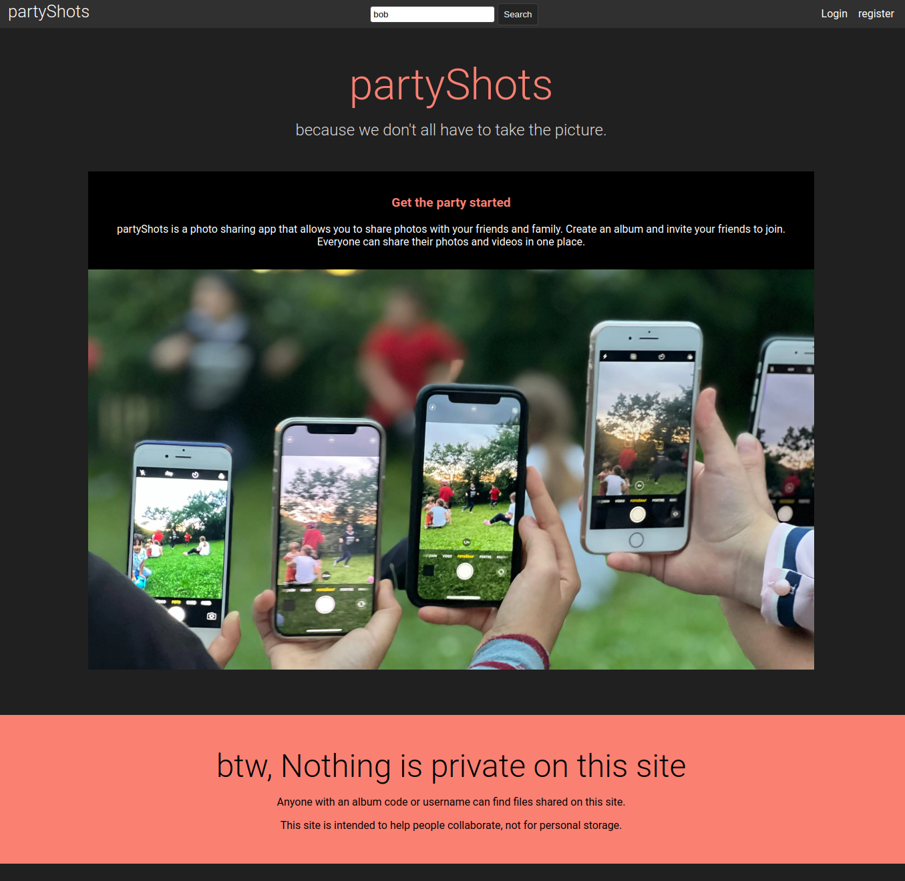
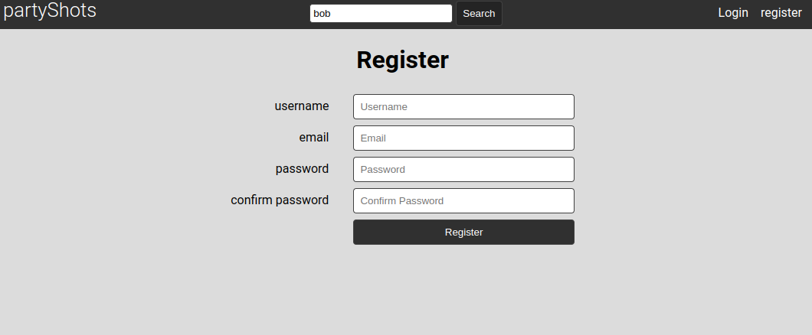
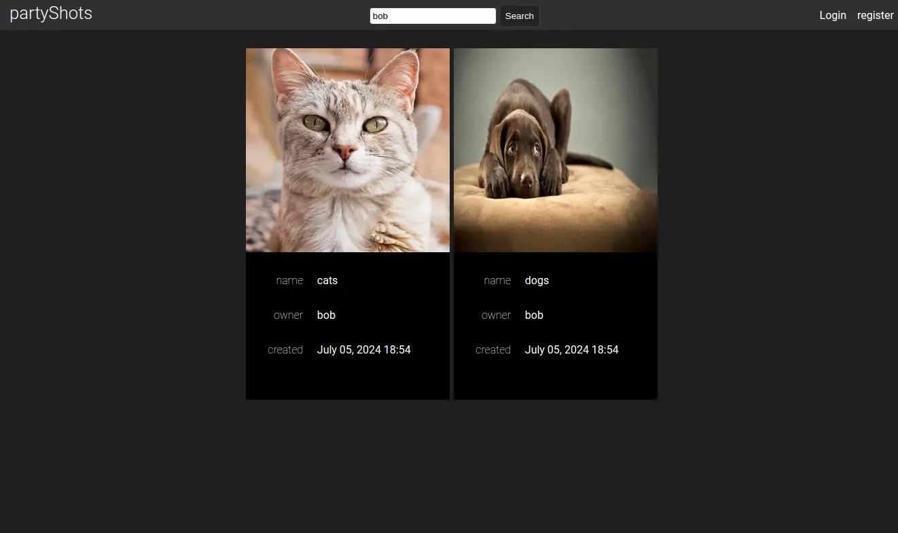
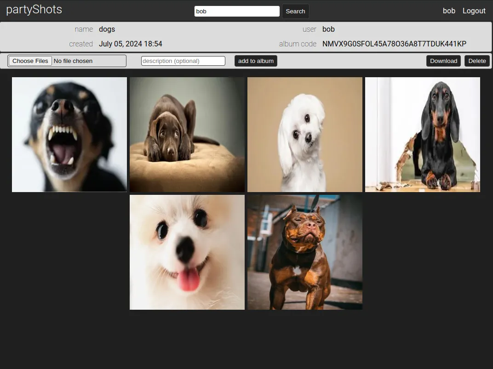

# partyShots

[live site](https://partyshots-react-da4d9cbe0452.herokuapp.com/)

This is a relatively simple photo sharing application that is meant to enable easy and simple photo sharing. Imagine a party where multiple people are in attendance, and may want to have photos to remember the event. They can either all take photos, or simply use a site like this one where anyone can upload photos and anyone else can get them. All they need is the album code.

## Structure

There are four different components to make this site work. 

* __React front end__ 
* __Django back end__ 
* __Postgres database__ - app data 
* __Amazon S3__ - user file storage

## Features

- **User accounts** - The site uses Django's built in authentication for user account management.
  
 

- **Album creation** - Users must be logged in to create new albums. However, anyone with the album code or album URL can view albums without logging in. **_There is no assumption of privacy on this site._**
  
- **Album Subscription** Users can add other albums to their pages, to easily browse or upload media.
- **Uploading media** - Users must be logged in to upload files. However, users can upload files to any album, not only their own.
  
- **File Support** - There is actually no limitation on the kind of file that may be uploaded, however thumbnail generation currently only works for image files. Video should follow soon.
- **Removing media** - A user can remove any album they create, and any files they have uploaded. Also, they can remove any file uploaded by another user to an album they have created. In this way they can curate albums.
- **Descriptions** - By default each photo needs a description, but this can set once and added to uploaded files in batches. The database stores these as tags with a key-value pair, so other features can be added in the future.

## Information flow

Photos are first uploaded to the site, and from the site uploaded to AWS S3 buckets. This is because the site generates thumbnails for each photo, and then stores both the thumbnail and original photo in Amazon S3 buckets.

Only metadata for these files are kept on the postgres database.

When a user is browsing the site the link for each photo and thumbnail is generated by using pre-signed download links, and the photos themselves are pulled from AWS. This keeps the workload on the server low.

## Database Structure

There are four database tables in addition to the tables used for user authentication.

### Album

An album represents a collection of files.

| Field      | Description                |
| ---------- | -------------------------- |
| id         | Primary Key                |
| code       | unique code for each album |
| name       | album name                 |
| user       | album creator/owner        |
| created_at | album creation time        |
| thumbnail  | link for album thumbnail   |

### Photo

A photo object represents an individual file.

| Field      | Description                            |
| ---------- | -------------------------------------- |
| id         | Primary Key                            |
| code       | unique code for each file              |
| user       | photo owner                            |
| album      | which album the photo belongs in       |
| link       | link to retrieve file from AWS S3      |
| tlink      | link to retrieve thumbnail from AWS S3 |
| created_at | file upload time                       |
| filename   | original filename                      |

### Tag

Tags are applied to photos, and are currently used to store descriptions for each photo.

| Field | Description                    |
| ----- | ------------------------------ |
| id    | Primary Key                    |
| photo | which photo the tag applies to |
| key   | key for each tag               |
| value | data for each tag              |

### Subs (subscriptions)

This table stores albums of other users that users may want easy access to.

| Field | Description                  |
| ----- | ---------------------------- |
| id    | Primary Key                  |
| album | album identifier             |
| user  | user subscribed to the album |

## Todo List

- tag implementation
- video thumbnail generation.
- drag drop file handling.
- user alerts for updated content.
- updating content in real time.
- S3 cleanup for deleted files.
